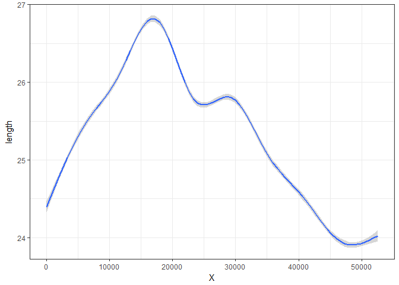
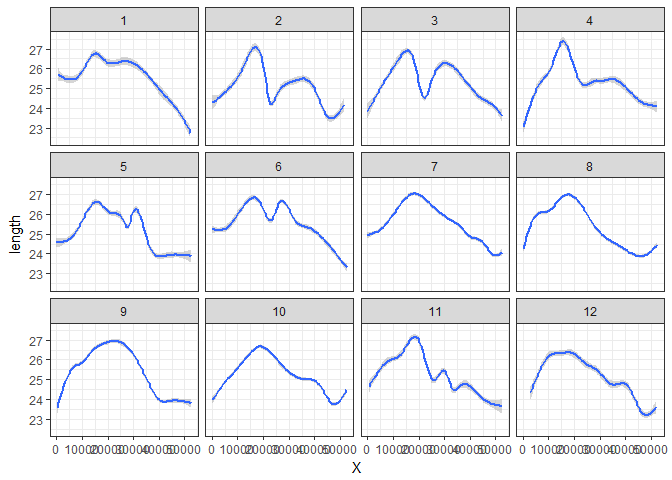
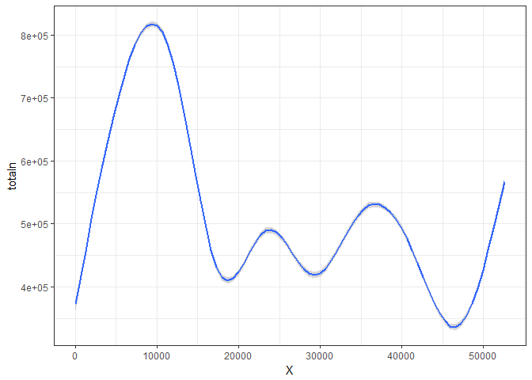
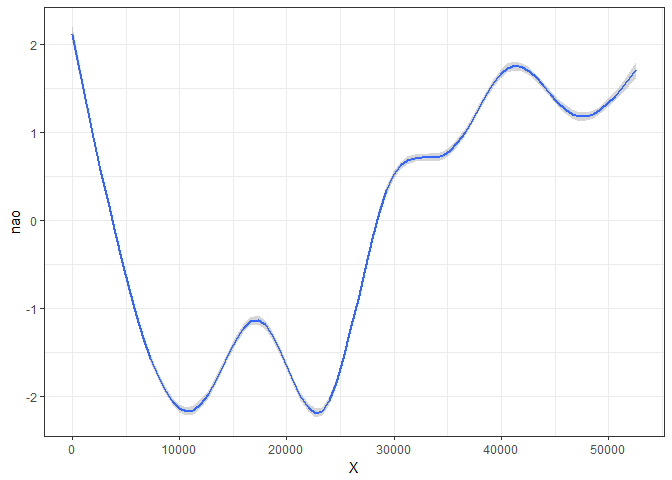

# Raport - śledzie
FW  
`r format(Sys.time(), '%d %B, %Y')`  


# Wstęp

// TODO 
Ponadto raport powinien zaczynać się od rozdziału podsumowującego całą analizę, streszczającego najważniejsze spostrzeżenia analityka.

# Wstępne przetwarzanie danych

## Kod wyliczający wykorzystane biblioteki.

Wykorzystano następujące biblioteki: 


```r
library(dplyr)
library(ggplot2)
library(plotly)
```


## Kod pozwalający wczytać dane z pliku.


## Kod zapewniający powtarzalność wyników przy każdym uruchomieniu raportu na tych samych danych.


## Kod przetwarzający brakujące dane.


## Sekcję podsumowującą rozmiar zbioru i podstawowe statystyki.

W poniższej tabeli przedstawiono kilka pierwszych wierszy z tabeli: 


```r
knitr::kable(head(herring))
```


  X   length  cfin1     cfin2     chel1     chel2      lcop1     lcop2        fbar     recr        cumf     totaln  sst                   sal   xmonth   nao
---  -------  --------  --------  --------  ---------  --------  ---------  ------  -------  ----------  ---------  --------------  ---------  -------  ----
  0     23.0  0.02778   0.27785   2.46875   ?          2.54787   26.35881    0.356   482831   0.3059879   267380.8  14.3069330186    35.51234        7   2.8
  1     22.5  0.02778   0.27785   2.46875   21.43548   2.54787   26.35881    0.356   482831   0.3059879   267380.8  14.3069330186    35.51234        7   2.8
  2     25.0  0.02778   0.27785   2.46875   21.43548   2.54787   26.35881    0.356   482831   0.3059879   267380.8  14.3069330186    35.51234        7   2.8
  3     25.5  0.02778   0.27785   2.46875   21.43548   2.54787   26.35881    0.356   482831   0.3059879   267380.8  14.3069330186    35.51234        7   2.8
  4     24.0  0.02778   0.27785   2.46875   21.43548   2.54787   26.35881    0.356   482831   0.3059879   267380.8  14.3069330186    35.51234        7   2.8
  5     22.0  0.02778   0.27785   2.46875   21.43548   2.54787   ?           0.356   482831   0.3059879   267380.8  14.3069330186    35.51234        7   2.8

Oznaczenia kolumn:

* X: numer badania (chronologicznie);
* length: długość złowionego śledzia [cm];
* cfin1: dostępność planktonu [zagęszczenie Calanus finmarchicus gat. 1];
* cfin2: dostępność planktonu [zagęszczenie Calanus finmarchicus gat. 2];
* chel1: dostępność planktonu [zagęszczenie Calanus helgolandicus gat. 1];
* chel2: dostępność planktonu [zagęszczenie Calanus helgolandicus gat. 2];
* lcop1: dostępność planktonu [zagęszczenie widłonogów gat. 1];
* lcop2: dostępność planktonu [zagęszczenie widłonogów gat. 2];
* fbar: natężenie połowów w regionie [ułamek pozostawionego narybku];
* recr: roczny narybek [liczba śledzi];
* cumf: łączne roczne natężenie połowów w regionie [ułamek pozostawionego narybku];
* totaln: łączna liczba ryb złowionych w ramach połowu [liczba śledzi];
* sst: temperatura przy powierzchni wody [°C];
* sal: poziom zasolenia wody [Knudsen ppt];
* xmonth: miesiąc połowu [numer miesiąca];
* nao: oscylacja północnoatlantycka [mb].

Poniżej przedstawiono statystyki poszczególnych kolumn:


```r
knitr::kable(summary(herring))
```

           X             length         cfin1           cfin2            chel1            chel2            lcop1            lcop2            fbar             recr              cumf             totaln                   sst             sal            xmonth            nao         
---  --------------  -------------  --------------  --------------  ---------------  ---------------  ---------------  ---------------  ---------------  ----------------  ----------------  ----------------  --------------------  --------------  ---------------  -----------------
     Min.   :    0   Min.   :19.0   0      :14287   0.70118: 4374   11.5    : 4787   5.67765 : 4365   23      : 4787   9.17171 : 4370   Min.   :0.0680   Min.   : 140515   Min.   :0.06833   Min.   : 144137   13.6315997001: 4359   Min.   :35.40   Min.   : 1.000   Min.   :-4.89000 
     1st Qu.:13145   1st Qu.:24.0   0.02778: 2225   0      : 3806   2.46875 : 2241   21.67333: 3710   2.54787 : 2215   24.85867: 3709   1st Qu.:0.2270   1st Qu.: 360061   1st Qu.:0.14809   1st Qu.: 306068   14.0693330238: 3700   1st Qu.:35.51   1st Qu.: 5.000   1st Qu.:-1.89000 
     Median :26291   Median :25.5   1.02508: 2067   0.296  : 3706   12.15192: 2109   39.56809: 2101   12.49588: 2105   41.65566: 2102   Median :0.3320   Median : 421391   Median :0.23191   Median : 539558   14.4415996823: 2080   Median :35.51   Median : 8.000   Median : 0.20000 
     Mean   :26291   Mean   :25.3   1.21333: 1985   0.11736: 2106   6.42127 : 2062   26.81218: 2002   10.92857: 2059   45.70773: 1998   Mean   :0.3304   Mean   : 520367   Mean   :0.22981   Mean   : 514973   13.5598663683: 2010   Mean   :35.51   Mean   : 7.258   Mean   :-0.09236 
     3rd Qu.:39436   3rd Qu.:26.5   0.33333: 1914   4.55825: 2007   19.15475: 2001   15.03   : 1941   21.23147: 1979   17.68   : 1959   3rd Qu.:0.4560   3rd Qu.: 724151   3rd Qu.:0.29803   3rd Qu.: 730351   13.694933032 : 1950   3rd Qu.:35.52   3rd Qu.: 9.000   3rd Qu.: 1.63000 
     Max.   :52581   Max.   :32.5   0.11111: 1891   0.85684: 1665   9.66667 : 1926   9.43208 : 1661   27.33333: 1916   10.72889: 1676   Max.   :0.8490   Max.   :1565890   Max.   :0.39801   Max.   :1015595   13.861999695 : 1673   Max.   :35.61   Max.   :12.000   Max.   : 5.08000 
     NA              NA             (Other):28213   (Other):34918   (Other) :37456   (Other) :36802   (Other) :37521   (Other) :36768   NA               NA                NA                NA                (Other)      :36810   NA              NA               NA               

# Analiza danych

## Szczegółową analizę wartości atrybutów (np. poprzez prezentację rozkładów wartości).


## Sekcję sprawdzającą korelacje między zmiennymi; sekcja ta powinna zawierać jakąś formę graficznej prezentacji korelacji.


## Interaktywny wykres lub animację prezentującą zmianę rozmiaru śledzi w czasie.


```r
ggplot(herring, aes(x=X, y=length)) + geom_smooth() + theme_bw()
```

```
## `geom_smooth()` using method = 'gam'
```

<!-- -->

```r
ggplot(herring, aes(x=X, y=length)) + geom_smooth() + theme_bw() + facet_wrap(~xmonth)
```

```
## `geom_smooth()` using method = 'gam'
```

<!-- -->

```r
ggplot(herring, aes(x=X, y=totaln)) + geom_smooth() + theme_bw()
```

```
## `geom_smooth()` using method = 'gam'
```

<!-- -->

```r
ggplot(herring, aes(x=X, y=nao)) + geom_smooth() + theme_bw()
```

```
## `geom_smooth()` using method = 'gam'
```

<!-- -->


# Regresor

## Sekcję próbującą stworzyć regresor przewidujący rozmiar śledzia (w tej sekcji należy wykorzystać wiedzę z pozostałych punktów oraz wykonać dodatkowe czynności, które mogą poprawić trafność predykcji); dobór parametrów modelu oraz oszacowanie jego skuteczności powinny zostać wykonane za pomocą techniki podziału zbioru na dane uczące, walidujące i testowe; trafność regresji powinna zostać oszacowana na podstawie miar R2R2 i RMSERMSE.


## Analizę ważności atrybutów najlepszego znalezionego modelu regresji. Analiza ważności atrybutów powinna stanowić próbę odpowiedzi na pytanie: co sprawia, że rozmiar śledzi zaczął w pewnym momencie maleć.


## Jeśli analityk uzna to za stosowne, powyższe punkty mogę być wykonane w innej kolejności. Analityk nie musi, a nawet nie powinien, ograniczać się do powyższych punktów. Wszelkie dodatkowe techniki analizy danych, wizualizacje, spostrzeżenia będą pozytwnie wpływały na ocenę.
