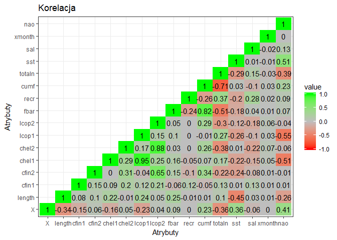

# Raport - śledzie
FW  
`r format(Sys.time(), '%d %B, %Y')`  


# Wstęp

// TODO 
Ponadto raport powinien zaczynać się od rozdziału podsumowującego całą analizę, streszczającego najważniejsze spostrzeżenia analityka.

# Wstępne przetwarzanie danych

## Kod wyliczający wykorzystane biblioteki.

Wykorzystano następujące biblioteki: 


```r
library(dplyr)
library(tidyr)
library(ggplot2)
library(plotly)
library(zoo)
library(reshape2)
```


## Kod pozwalający wczytać dane z pliku.


Dane zawierają 52582 próbek (wierszy) oraz 16 atrybutów (kolumn).

## Kod zapewniający powtarzalność wyników przy każdym uruchomieniu raportu na tych samych danych.
## Kod przetwarzający brakujące dane.


## Sekcję podsumowującą rozmiar zbioru i podstawowe statystyki.

W poniższej tabeli przedstawiono kilka pierwszych wierszy z tabeli: 


```r
knitr::kable(head(herring))
```


  X   length     cfin1     cfin2     chel1      chel2     lcop1      lcop2    fbar     recr        cumf     totaln        sst        sal   xmonth   nao
---  -------  --------  --------  --------  ---------  --------  ---------  ------  -------  ----------  ---------  ---------  ---------  -------  ----
  1     22.5   0.02778   0.27785   2.46875   21.43548   2.54787   26.35881   0.356   482831   0.3059879   267380.8   14.30693   35.51234        7   2.8
  2     25.0   0.02778   0.27785   2.46875   21.43548   2.54787   26.35881   0.356   482831   0.3059879   267380.8   14.30693   35.51234        7   2.8
  3     25.5   0.02778   0.27785   2.46875   21.43548   2.54787   26.35881   0.356   482831   0.3059879   267380.8   14.30693   35.51234        7   2.8
  4     24.0   0.02778   0.27785   2.46875   21.43548   2.54787   26.35881   0.356   482831   0.3059879   267380.8   14.30693   35.51234        7   2.8
  5     22.0   0.02778   0.27785   2.46875   21.43548   2.54787   26.35881   0.356   482831   0.3059879   267380.8   14.30693   35.51234        7   2.8
  6     24.0   0.02778   0.27785   2.46875   21.43548   2.54787   26.35881   0.356   482831   0.3059879   267380.8   14.30693   35.51234        7   2.8

Oznaczenia kolumn:

* X: numer badania (chronologicznie);
* length: długość złowionego śledzia [cm];
* cfin1: dostępność planktonu [zagęszczenie Calanus finmarchicus gat. 1];
* cfin2: dostępność planktonu [zagęszczenie Calanus finmarchicus gat. 2];
* chel1: dostępność planktonu [zagęszczenie Calanus helgolandicus gat. 1];
* chel2: dostępność planktonu [zagęszczenie Calanus helgolandicus gat. 2];
* lcop1: dostępność planktonu [zagęszczenie widłonogów gat. 1];
* lcop2: dostępność planktonu [zagęszczenie widłonogów gat. 2];
* fbar: natężenie połowów w regionie [ułamek pozostawionego narybku];
* recr: roczny narybek [liczba śledzi];
* cumf: łączne roczne natężenie połowów w regionie [ułamek pozostawionego narybku];
* totaln: łączna liczba ryb złowionych w ramach połowu [liczba śledzi];
* sst: temperatura przy powierzchni wody [°C];
* sal: poziom zasolenia wody [Knudsen ppt];
* xmonth: miesiąc połowu [numer miesiąca];
* nao: oscylacja północnoatlantycka [mb].

Poniżej przedstawiono statystyki poszczególnych kolumn:


```r
knitr::kable(summary(herring))
```

           X             length         cfin1             cfin2             chel1            chel2            lcop1              lcop2             fbar             recr              cumf             totaln             sst             sal            xmonth            nao         
---  --------------  -------------  ----------------  ----------------  ---------------  ---------------  -----------------  ---------------  ---------------  ----------------  ----------------  ----------------  --------------  --------------  ---------------  -----------------
     Min.   :    1   Min.   :19.0   Min.   : 0.0000   Min.   : 0.0000   Min.   : 0.000   Min.   : 5.238   Min.   :  0.3074   Min.   : 7.849   Min.   :0.0680   Min.   : 140515   Min.   :0.06833   Min.   : 144137   Min.   :12.77   Min.   :35.40   Min.   : 1.000   Min.   :-4.89000 
     1st Qu.:13146   1st Qu.:24.0   1st Qu.: 0.0000   1st Qu.: 0.2778   1st Qu.: 2.469   1st Qu.:13.427   1st Qu.:  2.5479   1st Qu.:17.808   1st Qu.:0.2270   1st Qu.: 360061   1st Qu.:0.14809   1st Qu.: 306068   1st Qu.:13.60   1st Qu.:35.51   1st Qu.: 5.000   1st Qu.:-1.89000 
     Median :26291   Median :25.5   Median : 0.1111   Median : 0.7012   Median : 5.750   Median :21.435   Median :  7.0000   Median :24.859   Median :0.3320   Median : 421391   Median :0.23191   Median : 539558   Median :13.86   Median :35.51   Median : 8.000   Median : 0.20000 
     Mean   :26291   Mean   :25.3   Mean   : 0.4463   Mean   : 2.0255   Mean   :10.004   Mean   :21.218   Mean   : 12.8029   Mean   :28.423   Mean   :0.3304   Mean   : 520367   Mean   :0.22981   Mean   : 514978   Mean   :13.87   Mean   :35.51   Mean   : 7.258   Mean   :-0.09241 
     3rd Qu.:39436   3rd Qu.:26.5   3rd Qu.: 0.3333   3rd Qu.: 1.7936   3rd Qu.:11.500   3rd Qu.:27.193   3rd Qu.: 21.2315   3rd Qu.:37.232   3rd Qu.:0.4560   3rd Qu.: 724151   3rd Qu.:0.29803   3rd Qu.: 730351   3rd Qu.:14.16   3rd Qu.:35.52   3rd Qu.: 9.000   3rd Qu.: 1.63000 
     Max.   :52581   Max.   :32.5   Max.   :37.6667   Max.   :19.3958   Max.   :75.000   Max.   :57.706   Max.   :115.5833   Max.   :68.736   Max.   :0.8490   Max.   :1565890   Max.   :0.39801   Max.   :1015595   Max.   :14.73   Max.   :35.61   Max.   :12.000   Max.   : 5.08000 

# Analiza danych

## Szczegółową analizę wartości atrybutów (np. poprzez prezentację rozkładów wartości).


```r
ggplot(herring, aes(x=X, y=length)) + geom_point() + geom_smooth() + theme_bw()
```

```
## `geom_smooth()` using method = 'gam'
```

-1.png)<!-- -->


```r
ggplot(herring, aes(x=X, y=length)) + geom_point() + geom_smooth() + theme_bw() + ylim(min(herring$length),max(herring$length)) + facet_wrap(~xmonth)
```

```
## `geom_smooth()` using method = 'gam'
```

_by_months-1.png)<!-- -->


```r
ggplot(herring, aes(x=X, y=totaln)) + geom_point() + geom_smooth() + theme_bw()
```

```
## `geom_smooth()` using method = 'gam'
```

-1.png)<!-- -->


```r
ggplot(herring, aes(x=X, y=recr)) + geom_point() + geom_smooth() + theme_bw()
```

```
## `geom_smooth()` using method = 'gam'
```

-1.png)<!-- -->


```r
food <- herring %>% gather(type, amount, cfin1:lcop2)
ggplot(food, aes(x = X, y = amount, colour = type)) + geom_smooth() + theme_bw()
```

```
## `geom_smooth()` using method = 'gam'
```

-1.png)<!-- -->

Natężenie połowów w trakcie pomiaru oraz łączne roczne natężęnie połowów:


```r
fbar_cumf <- herring %>% gather(type, amount, c(fbar, cumf))
ggplot(fbar_cumf, aes(x = X, y = amount, colour = type)) + geom_point() + geom_smooth() + theme_bw()
```

```
## `geom_smooth()` using method = 'gam'
```

-1.png)<!-- -->

Inne czynniki środowiskowe:


```r
ggplot(herring, aes(x=X, y=sst)) + geom_point() + geom_smooth() + theme_bw()
```

```
## `geom_smooth()` using method = 'gam'
```

-1.png)<!-- -->


```r
ggplot(herring, aes(x=X, y=sal)) + geom_point() + geom_smooth() + theme_bw()
```

```
## `geom_smooth()` using method = 'gam'
```

-1.png)<!-- -->


```r
ggplot(herring, aes(x=X, y=nao)) + geom_point() + geom_smooth() + theme_bw()
```

```
## `geom_smooth()` using method = 'gam'
```

-1.png)<!-- -->

## Sekcję sprawdzającą korelacje między zmiennymi; sekcja ta powinna zawierać jakąś formę graficznej prezentacji korelacji.


```r
# get correlation matrix
cor_matrix <- round(cor(herring, method="pearson"), 2)
# get lower triangle
cor_matrix[lower.tri(cor_matrix)] <- NA
# use reshape2 library to melt matrix for plotting
melted_cor_matrix <- melt(cor_matrix, na.rm = TRUE)
ggplot(data = melted_cor_matrix, aes(x=Var2, y=Var1, fill=value)) + geom_tile() + scale_fill_gradient2(low = "red", high = "green", mid = "gray", midpoint = 0, limit = c(-1,1), space = "Lab") + geom_text(aes(Var2, Var1, label = value), color = "black", size = 4) + theme_bw()
```

<!-- -->


## Interaktywny wykres lub animację prezentującą zmianę rozmiaru śledzi w czasie.


```r
p <- ggplot(herring, aes(x=X, y=length)) + geom_smooth() + theme_bw()
ggplotly(p)
```

```
## `geom_smooth()` using method = 'gam'
```

<!--html_preserve--><div id="htmlwidget-6ed7bcd9cebd90da8867" style="width:672px;height:480px;" class="plotly html-widget"></div>
<script type="application/json" data-for="htmlwidget-6ed7bcd9cebd90da8867">{"x":{"data":[{"x":[1,666.569620253165,1332.13924050633,1997.70886075949,2663.27848101266,3328.84810126582,3994.41772151899,4659.98734177215,5325.55696202532,5991.12658227848,6656.69620253165,7322.26582278481,7987.83544303797,8653.40506329114,9318.9746835443,9984.54430379747,10650.1139240506,11315.6835443038,11981.253164557,12646.8227848101,13312.3924050633,13977.9620253165,14643.5316455696,15309.1012658228,15974.6708860759,16640.2405063291,17305.8101265823,17971.3797468354,18636.9493670886,19302.5189873418,19968.0886075949,20633.6582278481,21299.2278481013,21964.7974683544,22630.3670886076,23295.9367088608,23961.5063291139,24627.0759493671,25292.6455696203,25958.2151898734,26623.7848101266,27289.3544303797,27954.9240506329,28620.4936708861,29286.0632911392,29951.6329113924,30617.2025316456,31282.7721518987,31948.3417721519,32613.9113924051,33279.4810126582,33945.0506329114,34610.6202531646,35276.1898734177,35941.7594936709,36607.329113924,37272.8987341772,37938.4683544304,38604.0379746835,39269.6075949367,39935.1772151899,40600.746835443,41266.3164556962,41931.8860759494,42597.4556962025,43263.0253164557,43928.5949367089,44594.164556962,45259.7341772152,45925.3037974684,46590.8734177215,47256.4430379747,47922.0126582278,48587.582278481,49253.1518987342,49918.7215189873,50584.2911392405,51249.8607594937,51915.4303797468,52581],"y":[24.4004698746537,24.5302008186325,24.658843238213,24.7853086089968,24.9085084065854,25.0273541065807,25.1407571845841,25.2476291161974,25.3468813770222,25.4374322657178,25.5193079749377,25.5948579484823,25.666724168751,25.737548618143,25.8099732790578,25.8866401338946,25.9701911650529,26.0632683549319,26.1683749670303,26.2838071806877,26.4029973437892,26.5191068688669,26.6252971684531,26.71472965508,26.7805657412799,26.8159668395849,26.8140943625274,26.7689273321184,26.6839494805629,26.5687766111583,26.4331267283868,26.2867178367307,26.1392679406724,26.0004950446942,25.8801171532783,25.787852270907,25.7313971477232,25.7071381946457,25.7075298512611,25.7250226093937,25.7520669608676,25.781113397507,25.8046124111362,25.8150144935794,25.8047728724771,25.7690656484598,25.7109090357292,25.6347199864099,25.544915452626,25.4459123865021,25.3421277401624,25.2379784657314,25.1378815153334,25.0462143467481,24.9649847570732,24.8925275693497,24.8268616518606,24.7660058728892,24.7079791007187,24.6508002036325,24.5924880499136,24.5310615078453,24.4646606118454,24.3936005707799,24.3200780612526,24.2463517969281,24.1746804914711,24.1073228585464,24.0465376118187,23.9945834649527,23.9537191316131,23.9259024661139,23.9107019907832,23.9065468218366,23.9118590583621,23.9250607994476,23.9445741441812,23.9688211916509,23.9962240409447,24.0252047911504],"text":["X: 1<br>length: 24.4","X: 666.57<br>length: 24.53","X: 1332.14<br>length: 24.66","X: 1997.71<br>length: 24.79","X: 2663.28<br>length: 24.91","X: 3328.85<br>length: 25.03","X: 3994.42<br>length: 25.14","X: 4659.99<br>length: 25.25","X: 5325.56<br>length: 25.35","X: 5991.13<br>length: 25.44","X: 6656.7<br>length: 25.52","X: 7322.27<br>length: 25.59","X: 7987.84<br>length: 25.67","X: 8653.41<br>length: 25.74","X: 9318.97<br>length: 25.81","X: 9984.54<br>length: 25.89","X: 10650.11<br>length: 25.97","X: 11315.68<br>length: 26.06","X: 11981.25<br>length: 26.17","X: 12646.82<br>length: 26.28","X: 13312.39<br>length: 26.4","X: 13977.96<br>length: 26.52","X: 14643.53<br>length: 26.63","X: 15309.1<br>length: 26.71","X: 15974.67<br>length: 26.78","X: 16640.24<br>length: 26.82","X: 17305.81<br>length: 26.81","X: 17971.38<br>length: 26.77","X: 18636.95<br>length: 26.68","X: 19302.52<br>length: 26.57","X: 19968.09<br>length: 26.43","X: 20633.66<br>length: 26.29","X: 21299.23<br>length: 26.14","X: 21964.8<br>length: 26","X: 22630.37<br>length: 25.88","X: 23295.94<br>length: 25.79","X: 23961.51<br>length: 25.73","X: 24627.08<br>length: 25.71","X: 25292.65<br>length: 25.71","X: 25958.22<br>length: 25.73","X: 26623.78<br>length: 25.75","X: 27289.35<br>length: 25.78","X: 27954.92<br>length: 25.8","X: 28620.49<br>length: 25.82","X: 29286.06<br>length: 25.8","X: 29951.63<br>length: 25.77","X: 30617.2<br>length: 25.71","X: 31282.77<br>length: 25.63","X: 31948.34<br>length: 25.54","X: 32613.91<br>length: 25.45","X: 33279.48<br>length: 25.34","X: 33945.05<br>length: 25.24","X: 34610.62<br>length: 25.14","X: 35276.19<br>length: 25.05","X: 35941.76<br>length: 24.96","X: 36607.33<br>length: 24.89","X: 37272.9<br>length: 24.83","X: 37938.47<br>length: 24.77","X: 38604.04<br>length: 24.71","X: 39269.61<br>length: 24.65","X: 39935.18<br>length: 24.59","X: 40600.75<br>length: 24.53","X: 41266.32<br>length: 24.46","X: 41931.89<br>length: 24.39","X: 42597.46<br>length: 24.32","X: 43263.03<br>length: 24.25","X: 43928.59<br>length: 24.17","X: 44594.16<br>length: 24.11","X: 45259.73<br>length: 24.05","X: 45925.3<br>length: 23.99","X: 46590.87<br>length: 23.95","X: 47256.44<br>length: 23.93","X: 47922.01<br>length: 23.91","X: 48587.58<br>length: 23.91","X: 49253.15<br>length: 23.91","X: 49918.72<br>length: 23.93","X: 50584.29<br>length: 23.94","X: 51249.86<br>length: 23.97","X: 51915.43<br>length: 24","X: 52581<br>length: 24.03"],"key":null,"type":"scatter","mode":"lines","name":"fitted values","line":{"width":3.77952755905512,"color":"rgba(51,102,255,1)","dash":"solid"},"hoveron":"points","showlegend":false,"xaxis":"x","yaxis":"y","hoverinfo":"text"},{"x":[1,666.569620253165,1332.13924050633,1997.70886075949,2663.27848101266,3328.84810126582,3994.41772151899,4659.98734177215,5325.55696202532,5991.12658227848,6656.69620253165,7322.26582278481,7987.83544303797,8653.40506329114,9318.9746835443,9984.54430379747,10650.1139240506,11315.6835443038,11981.253164557,12646.8227848101,13312.3924050633,13977.9620253165,14643.5316455696,15309.1012658228,15974.6708860759,16640.2405063291,17305.8101265823,17971.3797468354,18636.9493670886,19302.5189873418,19968.0886075949,20633.6582278481,21299.2278481013,21964.7974683544,22630.3670886076,23295.9367088608,23961.5063291139,24627.0759493671,25292.6455696203,25958.2151898734,26623.7848101266,27289.3544303797,27954.9240506329,28620.4936708861,29286.0632911392,29951.6329113924,30617.2025316456,31282.7721518987,31948.3417721519,32613.9113924051,33279.4810126582,33945.0506329114,34610.6202531646,35276.1898734177,35941.7594936709,36607.329113924,37272.8987341772,37938.4683544304,38604.0379746835,39269.6075949367,39935.1772151899,40600.746835443,41266.3164556962,41931.8860759494,42597.4556962025,43263.0253164557,43928.5949367089,44594.164556962,45259.7341772152,45925.3037974684,46590.8734177215,47256.4430379747,47922.0126582278,48587.582278481,49253.1518987342,49918.7215189873,50584.2911392405,51249.8607594937,51915.4303797468,52581,52581,52581,51915.4303797468,51249.8607594937,50584.2911392405,49918.7215189873,49253.1518987342,48587.582278481,47922.0126582278,47256.4430379747,46590.8734177215,45925.3037974684,45259.7341772152,44594.164556962,43928.5949367089,43263.0253164557,42597.4556962025,41931.8860759494,41266.3164556962,40600.746835443,39935.1772151899,39269.6075949367,38604.0379746835,37938.4683544304,37272.8987341772,36607.329113924,35941.7594936709,35276.1898734177,34610.6202531646,33945.0506329114,33279.4810126582,32613.9113924051,31948.3417721519,31282.7721518987,30617.2025316456,29951.6329113924,29286.0632911392,28620.4936708861,27954.9240506329,27289.3544303797,26623.7848101266,25958.2151898734,25292.6455696203,24627.0759493671,23961.5063291139,23295.9367088608,22630.3670886076,21964.7974683544,21299.2278481013,20633.6582278481,19968.0886075949,19302.5189873418,18636.9493670886,17971.3797468354,17305.8101265823,16640.2405063291,15974.6708860759,15309.1012658228,14643.5316455696,13977.9620253165,13312.3924050633,12646.8227848101,11981.253164557,11315.6835443038,10650.1139240506,9984.54430379747,9318.9746835443,8653.40506329114,7987.83544303797,7322.26582278481,6656.69620253165,5991.12658227848,5325.55696202532,4659.98734177215,3994.41772151899,3328.84810126582,2663.27848101266,1997.70886075949,1332.13924050633,666.569620253165,1,1],"y":[24.3279949425943,24.4704451497993,24.6102543712871,24.7453212414482,24.8735265763979,24.9935342129006,25.1054277761247,25.2099539921229,25.3075144197525,25.3979314093596,25.4813685485913,25.559390133193,25.6335484847821,25.7054319038925,25.7771656240967,25.8517655827956,25.9328781450957,26.0242586700572,26.1292987435356,26.2463397146772,26.3679371763412,26.4861314890009,26.5930679121921,26.6815182862408,26.7451517641943,26.7781888803958,26.7748933529919,26.7300477245821,26.6469289148146,26.5341913727405,26.400417547998,26.2543937431575,26.1056352112174,25.9645304274542,25.8419050415149,25.7485476463214,25.6928121737567,25.6706310677643,25.6734345948728,25.6925407648422,25.7195851163161,25.7470181411206,25.7681052842635,25.7764295196339,25.7654682479299,25.7308535367553,25.6749444185677,25.6010872570463,25.5125913591455,25.4132032061959,25.3075425018146,25.2009579000472,25.0990019078667,25.0070133372956,24.9272067979733,24.8571135923275,24.7936502830052,24.7337766164794,24.6750037205591,24.6157400357901,24.5550205834859,24.4919852839995,24.4256509267745,24.3562875508392,24.2852035103802,24.2135441423314,24.1425637775959,24.074147174855,24.0110697966911,23.9566440387239,23.9142182754395,23.8865355091825,23.8730268671583,23.871217413648,23.8780391641368,23.8900789670723,23.9045867723087,23.9202323182703,23.936468363711,23.9527298489093,23.9527298489093,24.0976797333915,24.0559797181783,24.0174100650316,23.9845615160538,23.9600426318229,23.9456789525873,23.9418762300252,23.9483771144081,23.9652694230454,23.9932199877868,24.0325228911815,24.0820054269463,24.1404985422378,24.2067972053463,24.2791594515248,24.3549526121249,24.4309135907207,24.5036702969163,24.5701377316911,24.6299555163412,24.6858603714748,24.7409544808783,24.798235129299,24.860073020716,24.9279415463718,25.0027627161732,25.0854153562006,25.1767611228001,25.2749990314156,25.3767129785103,25.4786215668083,25.5772395461066,25.6683527157734,25.7468736528908,25.8072777601642,25.8440774970243,25.8535994675249,25.841119538009,25.8152086538934,25.784548805419,25.7575044539451,25.7416251076494,25.7436453215271,25.7699821216897,25.8271568954926,25.9183292650416,26.0364596619342,26.1729006701275,26.319041930304,26.4658359087756,26.603361849576,26.7209700463113,26.8078069396548,26.8532953720628,26.853744798774,26.8159797183655,26.7479410239192,26.6575264247141,26.5520822487328,26.4380575112371,26.3212746466982,26.2074511905251,26.1022780398066,26.00750418501,25.9215146849937,25.8427809340189,25.7696653323936,25.6998998527198,25.6303257637717,25.5572474012841,25.476933122076,25.3862483342919,25.285304240272,25.1760865930436,25.0611740002608,24.943490236773,24.8252959765453,24.7074321051389,24.5899564874657,24.4729448067131,24.3279949425943],"text":["X: 1<br>length: 24.4","X: 666.57<br>length: 24.53","X: 1332.14<br>length: 24.66","X: 1997.71<br>length: 24.79","X: 2663.28<br>length: 24.91","X: 3328.85<br>length: 25.03","X: 3994.42<br>length: 25.14","X: 4659.99<br>length: 25.25","X: 5325.56<br>length: 25.35","X: 5991.13<br>length: 25.44","X: 6656.7<br>length: 25.52","X: 7322.27<br>length: 25.59","X: 7987.84<br>length: 25.67","X: 8653.41<br>length: 25.74","X: 9318.97<br>length: 25.81","X: 9984.54<br>length: 25.89","X: 10650.11<br>length: 25.97","X: 11315.68<br>length: 26.06","X: 11981.25<br>length: 26.17","X: 12646.82<br>length: 26.28","X: 13312.39<br>length: 26.4","X: 13977.96<br>length: 26.52","X: 14643.53<br>length: 26.63","X: 15309.1<br>length: 26.71","X: 15974.67<br>length: 26.78","X: 16640.24<br>length: 26.82","X: 17305.81<br>length: 26.81","X: 17971.38<br>length: 26.77","X: 18636.95<br>length: 26.68","X: 19302.52<br>length: 26.57","X: 19968.09<br>length: 26.43","X: 20633.66<br>length: 26.29","X: 21299.23<br>length: 26.14","X: 21964.8<br>length: 26","X: 22630.37<br>length: 25.88","X: 23295.94<br>length: 25.79","X: 23961.51<br>length: 25.73","X: 24627.08<br>length: 25.71","X: 25292.65<br>length: 25.71","X: 25958.22<br>length: 25.73","X: 26623.78<br>length: 25.75","X: 27289.35<br>length: 25.78","X: 27954.92<br>length: 25.8","X: 28620.49<br>length: 25.82","X: 29286.06<br>length: 25.8","X: 29951.63<br>length: 25.77","X: 30617.2<br>length: 25.71","X: 31282.77<br>length: 25.63","X: 31948.34<br>length: 25.54","X: 32613.91<br>length: 25.45","X: 33279.48<br>length: 25.34","X: 33945.05<br>length: 25.24","X: 34610.62<br>length: 25.14","X: 35276.19<br>length: 25.05","X: 35941.76<br>length: 24.96","X: 36607.33<br>length: 24.89","X: 37272.9<br>length: 24.83","X: 37938.47<br>length: 24.77","X: 38604.04<br>length: 24.71","X: 39269.61<br>length: 24.65","X: 39935.18<br>length: 24.59","X: 40600.75<br>length: 24.53","X: 41266.32<br>length: 24.46","X: 41931.89<br>length: 24.39","X: 42597.46<br>length: 24.32","X: 43263.03<br>length: 24.25","X: 43928.59<br>length: 24.17","X: 44594.16<br>length: 24.11","X: 45259.73<br>length: 24.05","X: 45925.3<br>length: 23.99","X: 46590.87<br>length: 23.95","X: 47256.44<br>length: 23.93","X: 47922.01<br>length: 23.91","X: 48587.58<br>length: 23.91","X: 49253.15<br>length: 23.91","X: 49918.72<br>length: 23.93","X: 50584.29<br>length: 23.94","X: 51249.86<br>length: 23.97","X: 51915.43<br>length: 24","X: 52581<br>length: 24.03","X: 52581<br>length: 24.03","X: 52581<br>length: 24.03","X: 51915.43<br>length: 24","X: 51249.86<br>length: 23.97","X: 50584.29<br>length: 23.94","X: 49918.72<br>length: 23.93","X: 49253.15<br>length: 23.91","X: 48587.58<br>length: 23.91","X: 47922.01<br>length: 23.91","X: 47256.44<br>length: 23.93","X: 46590.87<br>length: 23.95","X: 45925.3<br>length: 23.99","X: 45259.73<br>length: 24.05","X: 44594.16<br>length: 24.11","X: 43928.59<br>length: 24.17","X: 43263.03<br>length: 24.25","X: 42597.46<br>length: 24.32","X: 41931.89<br>length: 24.39","X: 41266.32<br>length: 24.46","X: 40600.75<br>length: 24.53","X: 39935.18<br>length: 24.59","X: 39269.61<br>length: 24.65","X: 38604.04<br>length: 24.71","X: 37938.47<br>length: 24.77","X: 37272.9<br>length: 24.83","X: 36607.33<br>length: 24.89","X: 35941.76<br>length: 24.96","X: 35276.19<br>length: 25.05","X: 34610.62<br>length: 25.14","X: 33945.05<br>length: 25.24","X: 33279.48<br>length: 25.34","X: 32613.91<br>length: 25.45","X: 31948.34<br>length: 25.54","X: 31282.77<br>length: 25.63","X: 30617.2<br>length: 25.71","X: 29951.63<br>length: 25.77","X: 29286.06<br>length: 25.8","X: 28620.49<br>length: 25.82","X: 27954.92<br>length: 25.8","X: 27289.35<br>length: 25.78","X: 26623.78<br>length: 25.75","X: 25958.22<br>length: 25.73","X: 25292.65<br>length: 25.71","X: 24627.08<br>length: 25.71","X: 23961.51<br>length: 25.73","X: 23295.94<br>length: 25.79","X: 22630.37<br>length: 25.88","X: 21964.8<br>length: 26","X: 21299.23<br>length: 26.14","X: 20633.66<br>length: 26.29","X: 19968.09<br>length: 26.43","X: 19302.52<br>length: 26.57","X: 18636.95<br>length: 26.68","X: 17971.38<br>length: 26.77","X: 17305.81<br>length: 26.81","X: 16640.24<br>length: 26.82","X: 15974.67<br>length: 26.78","X: 15309.1<br>length: 26.71","X: 14643.53<br>length: 26.63","X: 13977.96<br>length: 26.52","X: 13312.39<br>length: 26.4","X: 12646.82<br>length: 26.28","X: 11981.25<br>length: 26.17","X: 11315.68<br>length: 26.06","X: 10650.11<br>length: 25.97","X: 9984.54<br>length: 25.89","X: 9318.97<br>length: 25.81","X: 8653.41<br>length: 25.74","X: 7987.84<br>length: 25.67","X: 7322.27<br>length: 25.59","X: 6656.7<br>length: 25.52","X: 5991.13<br>length: 25.44","X: 5325.56<br>length: 25.35","X: 4659.99<br>length: 25.25","X: 3994.42<br>length: 25.14","X: 3328.85<br>length: 25.03","X: 2663.28<br>length: 24.91","X: 1997.71<br>length: 24.79","X: 1332.14<br>length: 24.66","X: 666.57<br>length: 24.53","X: 1<br>length: 24.4","X: 1<br>length: 24.4"],"key":null,"type":"scatter","mode":"lines","line":{"width":3.77952755905512,"color":"transparent","dash":"solid"},"fill":"toself","fillcolor":"rgba(153,153,153,0.4)","hoveron":"points","hoverinfo":"x+y","showlegend":false,"xaxis":"x","yaxis":"y","name":""}],"layout":{"margin":{"t":26.2283105022831,"r":7.30593607305936,"b":40.1826484018265,"l":37.2602739726027},"plot_bgcolor":"rgba(255,255,255,1)","paper_bgcolor":"rgba(255,255,255,1)","font":{"color":"rgba(0,0,0,1)","family":"","size":14.6118721461187},"xaxis":{"domain":[0,1],"type":"linear","autorange":false,"tickmode":"array","range":[-2628,55210],"ticktext":["0","10000","20000","30000","40000","50000"],"tickvals":[0,10000,20000,30000,40000,50000],"ticks":"outside","tickcolor":"rgba(51,51,51,1)","ticklen":3.65296803652968,"tickwidth":0.66417600664176,"showticklabels":true,"tickfont":{"color":"rgba(77,77,77,1)","family":"","size":11.689497716895},"tickangle":-0,"showline":false,"linecolor":null,"linewidth":0,"showgrid":true,"gridcolor":"rgba(235,235,235,1)","gridwidth":0.66417600664176,"zeroline":false,"anchor":"y","title":"X","titlefont":{"color":"rgba(0,0,0,1)","family":"","size":14.6118721461187},"hoverformat":".2f"},"yaxis":{"domain":[0,1],"type":"linear","autorange":false,"tickmode":"array","range":[23.7220910443917,27.0028711680303],"ticktext":["24","25","26","27"],"tickvals":[24,25,26,27],"ticks":"outside","tickcolor":"rgba(51,51,51,1)","ticklen":3.65296803652968,"tickwidth":0.66417600664176,"showticklabels":true,"tickfont":{"color":"rgba(77,77,77,1)","family":"","size":11.689497716895},"tickangle":-0,"showline":false,"linecolor":null,"linewidth":0,"showgrid":true,"gridcolor":"rgba(235,235,235,1)","gridwidth":0.66417600664176,"zeroline":false,"anchor":"x","title":"length","titlefont":{"color":"rgba(0,0,0,1)","family":"","size":14.6118721461187},"hoverformat":".2f"},"shapes":[{"type":"rect","fillcolor":"transparent","line":{"color":"rgba(51,51,51,1)","width":0.66417600664176,"linetype":"solid"},"yref":"paper","xref":"paper","x0":0,"x1":1,"y0":0,"y1":1}],"showlegend":false,"legend":{"bgcolor":"rgba(255,255,255,1)","bordercolor":"transparent","borderwidth":1.88976377952756,"font":{"color":"rgba(0,0,0,1)","family":"","size":11.689497716895}},"hovermode":"closest"},"source":"A","config":{"modeBarButtonsToAdd":[{"name":"Collaborate","icon":{"width":1000,"ascent":500,"descent":-50,"path":"M487 375c7-10 9-23 5-36l-79-259c-3-12-11-23-22-31-11-8-22-12-35-12l-263 0c-15 0-29 5-43 15-13 10-23 23-28 37-5 13-5 25-1 37 0 0 0 3 1 7 1 5 1 8 1 11 0 2 0 4-1 6 0 3-1 5-1 6 1 2 2 4 3 6 1 2 2 4 4 6 2 3 4 5 5 7 5 7 9 16 13 26 4 10 7 19 9 26 0 2 0 5 0 9-1 4-1 6 0 8 0 2 2 5 4 8 3 3 5 5 5 7 4 6 8 15 12 26 4 11 7 19 7 26 1 1 0 4 0 9-1 4-1 7 0 8 1 2 3 5 6 8 4 4 6 6 6 7 4 5 8 13 13 24 4 11 7 20 7 28 1 1 0 4 0 7-1 3-1 6-1 7 0 2 1 4 3 6 1 1 3 4 5 6 2 3 3 5 5 6 1 2 3 5 4 9 2 3 3 7 5 10 1 3 2 6 4 10 2 4 4 7 6 9 2 3 4 5 7 7 3 2 7 3 11 3 3 0 8 0 13-1l0-1c7 2 12 2 14 2l218 0c14 0 25-5 32-16 8-10 10-23 6-37l-79-259c-7-22-13-37-20-43-7-7-19-10-37-10l-248 0c-5 0-9-2-11-5-2-3-2-7 0-12 4-13 18-20 41-20l264 0c5 0 10 2 16 5 5 3 8 6 10 11l85 282c2 5 2 10 2 17 7-3 13-7 17-13z m-304 0c-1-3-1-5 0-7 1-1 3-2 6-2l174 0c2 0 4 1 7 2 2 2 4 4 5 7l6 18c0 3 0 5-1 7-1 1-3 2-6 2l-173 0c-3 0-5-1-8-2-2-2-4-4-4-7z m-24-73c-1-3-1-5 0-7 2-2 3-2 6-2l174 0c2 0 5 0 7 2 3 2 4 4 5 7l6 18c1 2 0 5-1 6-1 2-3 3-5 3l-174 0c-3 0-5-1-7-3-3-1-4-4-5-6z"},"click":"function(gd) { \n        // is this being viewed in RStudio?\n        if (location.search == '?viewer_pane=1') {\n          alert('To learn about plotly for collaboration, visit:\\n https://cpsievert.github.io/plotly_book/plot-ly-for-collaboration.html');\n        } else {\n          window.open('https://cpsievert.github.io/plotly_book/plot-ly-for-collaboration.html', '_blank');\n        }\n      }"}],"modeBarButtonsToRemove":["sendDataToCloud"]},"base_url":"https://plot.ly"},"evals":["config.modeBarButtonsToAdd.0.click"],"jsHooks":[]}</script><!--/html_preserve-->


# Regresor

## Sekcję próbującą stworzyć regresor przewidujący rozmiar śledzia (w tej sekcji należy wykorzystać wiedzę z pozostałych punktów oraz wykonać dodatkowe czynności, które mogą poprawić trafność predykcji); dobór parametrów modelu oraz oszacowanie jego skuteczności powinny zostać wykonane za pomocą techniki podziału zbioru na dane uczące, walidujące i testowe; trafność regresji powinna zostać oszacowana na podstawie miar R2 i RMSE.


## Analizę ważności atrybutów najlepszego znalezionego modelu regresji. Analiza ważności atrybutów powinna stanowić próbę odpowiedzi na pytanie: co sprawia, że rozmiar śledzi zaczął w pewnym momencie maleć.


## Jeśli analityk uzna to za stosowne, powyższe punkty mogę być wykonane w innej kolejności. Analityk nie musi, a nawet nie powinien, ograniczać się do powyższych punktów. Wszelkie dodatkowe techniki analizy danych, wizualizacje, spostrzeżenia będą pozytwnie wpływały na ocenę.
